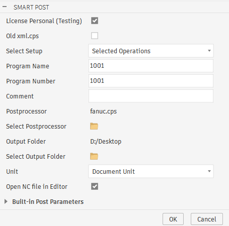
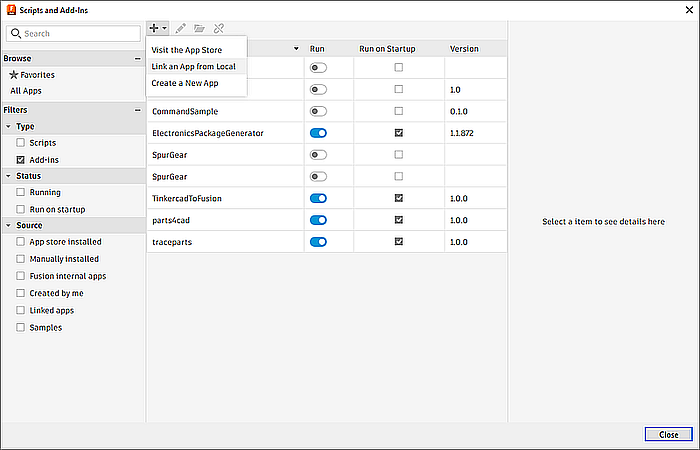
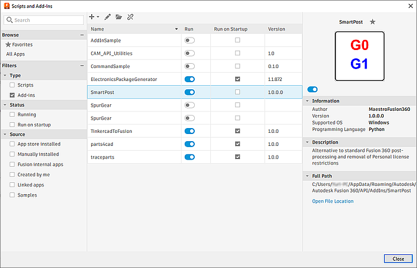
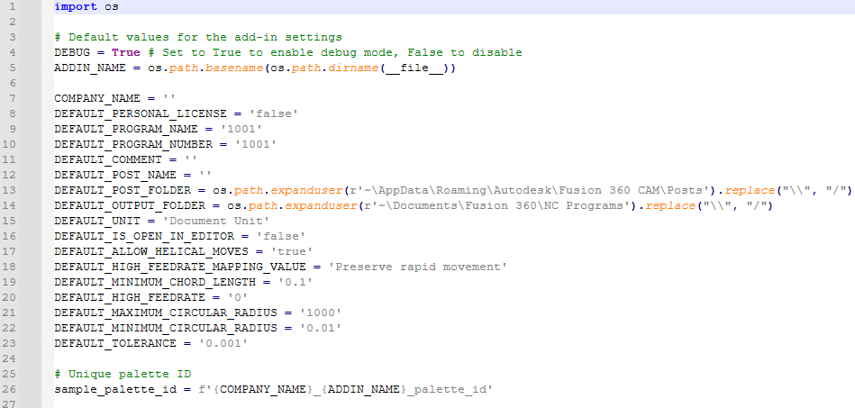

<!-- markdownlint-disable MD033 -->
<!-- markdownlint-disable MD045 -->
<h1 align="center">
  
  SmartPost for Fusion 360
</h1>

<p align="center">
  <strong>Alternative to standard Fusion 360 post-processing and removal of Personal license restrictions</strong>
</p>

<p align="center">
  <a href="LICENSE.md">
    
  </a>
</p>

---

## Table of Contents

- [Table of Contents](#table-of-contents)
- [Overview](#overview)
- [Key Features](#key-features)
  - [Notes](#notes)
- [Technical Constraints\*\*](#technical-constraints)
- [Installation \& Usage](#installation--usage)
  - [Configuration](#configuration)
- [Roadmap](#roadmap)
  - [Q4 2026](#q4-2026)
    - [Postprocessor Enhancements](#postprocessor-enhancements)
  - [Q1 2027](#q1-2027)
- [XML cycle tests](#xml-cycle-tests)
- [License \& Disclaimer](#license--disclaimer)
  - [Contact Me](#contact-me)

---

## Overview

<details>
  <summary>Click to see the image</summary>
  <h1 align="center">
    
  </h1>
</details>

**SmartPost** bridges the gap between **Fusion 360 Personal** and commercial CAM capabilities by leveraging the undocumented XML post-processing pipeline. This add-in provides:

**SmartPost enhances Fusion 360 capabilities by delivering:**

1. **Full toolchange operations output** (restricted in Personal license)
2. **No Watermarks** (restricted in Personal license)
3. **Simplified NCPrograms interface alternative** (first-ever implementation for Fusion 360)
4. **G-code generation using any Fusion 360 postprocessors** (standard .cps files)
5. **Extensibility and open platform** (customizable for various workflows and third-party integrations)

> ⚠️ **Technical foundation**: utilizes **post.exe** engine via **xml.cps** intermediate files.

---

## Key Features

| Feature | Commercial | Personal |
| --- | --- | --- |
| Automatic Tool Changes | ✅ Full support | ✅ Unlimited tools |
| 3 axis milling | ✅ Full support | ✅ Any `.cps` compatible |
| **User comments** | ✅ Full support | ⚠️ Only program-level comments |
| **Drilling Cycles** | ✅ Full support | ✅ Canned cycles through the selected `.cps` |
| **2 axis turning** | ✅ Full support | ❌ Not supported yet |
| **Manual NC** | ✅ Full support | ❌ Not supported yet |
| **Rapid moves** | ✅ Full support | ⚠️ Preserved when exposed by Fusion as rapid |
| **Probing** | ✅ Full support | ❌ Not supported yet |
| **3+2 axis milling** | ✅ Full support | ❌ Not supported yet |

### Notes

1. **Legend**:

   - ✅: Fully supported
   - ⚠️: Partially supported (with limitations)
   - ❌: Not supported yet

2. **Canned drilling cycles**: The current `xml_last.cps` preserves grouped
   cycle data through the Autodesk XML importer. Standard downstream posts can
   generate native cycles such as G81, G83, G84, G86, and G87 when supported by
   the selected postprocessor. The legacy `xml.cps` remains available for
   compatibility and expands cycles into basic moves.

3. **Limitations in Fusion 360 XML Post-Processing**:
   Autodesk Post Engine 5.388.0 still fails to import grouped
   `circular-pocket-milling` and `thread-milling` operations, and turning
   sections are not restored as turning sections. These limitations do not
   affect the verified drilling-cycle round-trip.

4. **Section type diagnostics**: `xml_last.cps` provides the optional
   `diagnosticSectionType` property. When enabled, it logs the source
   `currentSection.type` received from Fusion without adding diagnostic records
   to the XML. The property is disabled by default and can be enabled for a
   direct `post.exe` run with:

   ```text
   --property diagnosticSectionType true
   ```

---

## Technical Constraints\*\*

**SmartPost Final G-code in 2 Stages:**

1. **Fusion 360**:

   - Uses `xml.cps` for post-processing. The `xml.cps` file contains configuration settings specific to the machine and tool operations.
   - Fusion 360 CAM generates intermediate XML files that contain machining data. These intermediate files are then merged into one final file.

2. **post.exe**:

   - The external post-processor for Fusion 360 takes the generated `.xml` and `.cps` files as input.
   - It processes these files and creates the final machining instructions, which are then used to generate the correct G-code for the CNC machine.

   ```mermaid
   graph LR
     A(Fusion 360 CAM) --> B{xml.cps}
     B --> C(post.exe + any .cps post)
     C --> D((G-code))
   ```

### Downstream post compatibility and performance

SmartPost can run any selected `.cps`, but every downstream post receives
sections reconstructed by the Autodesk XML importer rather than native Fusion
sections. Post implementations that repeatedly call
`Section.getProperty()` or `Section.getParameter()` can therefore be much
slower through SmartPost, even when the same post processes native CNC
intermediate data quickly.

This limitation is not specific to Fanuc and can affect any downstream post
that uses section-scoped property or parameter lookup. A confirmed example with
Autodesk Post Engine 5.388.0 is the Autodesk Fanuc revision 44236:

```text
Old Fanuc revision + XML:                         0.295 s
New Fanuc revision + XML:                        29.897 s
New Fanuc with old initializeSmoothing + XML:     0.188 s
New Fanuc revision + native CNC intermediate:     1.187 s
```

The regression is caused by the newer `initializeSmoothing(_section)` using
`_section.getProperty()` and `_section.getParameter()`. Passing
`--property useSmoothing -1` does not avoid those lookups. Options such as
`--noprogress`, `--quiet`, `--nointeraction`, `--noworkmapping`, and `--format`
do not fix the XML-section performance issue.

Recommended workarounds:

1. Use a previous compatible revision of the selected post until its vendor
   fixes XML-imported Section access.
2. Post authors can use global `getProperty()` / `getParameter()` when the
   intended target is `currentSection`, after verifying behavior for native and
   XML intermediate inputs.
3. Compare both paths with the same toolpath before upgrading a production
   post. The diagnostic script is `tmp/test-fanuc-performance.py`.

SmartPost never modifies or temporarily patches a user-selected `.cps`.

---

## Installation & Usage

<details>
  <summary>Click to see the image</summary>
  <h1 align="center">
    
    
  </h1>
</details>

- ### Setup

1. Download latest `.zip` release.
2. Extract the archive.
3. Copy the add-on folder to the following directory:  
   **`%appdata%\Autodesk\Autodesk Fusion 360\API\AddIns`**.
4. Open **Fusion 360**.
5. Press **`Shift + S`** or go to **Tools → Scripts and Add-Ins**.
6. In the upper part of the window, click on the **plus** (**`+`**).
7. In the Add-Ins dialog, choose `Link an App from Local` to load your add-on directly from a local folder. Navigate to the folder where your add-on is located and select it.
8. Select the add-on from the list and click **`Run`**.
9. To have the add-on run automatically at startup, check the **`Run on Startup`** box.

**⚠️ Important:**

- **SmartPost** works **only on Windows**.
- If the **AddIns** folder doesn't exist, create it manually.
- If the add-on doesn't run, try restarting Fusion 360.

### Configuration

SmartPost default settings are in the `config.py` file:

<details>
  <summary>Click to see the image</summary>
  <h1 align="center">
    
  </h1>
</details>

---

## Roadmap

Planned improvements for future releases.

### Q4 2026

#### Postprocessor Enhancements

Improve support for the intermediate XML workflow, including:

- 2D turning operations
- Manual NC code insertion

> **Current limitation:** Autodesk Post Engine 5.388.0 does not preserve `Section.type` when processing the intermediate XML format. The XML importer does not parse attributes on `<section>`, so turning sections are reconstructed as the default `TYPE_MILLING`.
>
> As a result, proper turning support cannot be implemented in `xml_last.cps` alone.

### Q1 2027

- Extend the list of configurable postprocessor parameters

**Community contributions are welcome.** See [CONTRIBUTING.md](CONTRIBUTING.md) for development guidelines.

**Found a bug?** [Open an Issue](https://github.com/MaestroFusion360/SmartPost/issues)

---

## XML cycle tests

The PowerShell scripts in [`scripts`](scripts) exercise the complete XML
round-trip without modifying the selected downstream `.cps` file. They can test
both `xml_last.cps` and the legacy `xml.cps` against Autodesk Post Utility
`.cnc` datasets. See [`scripts/README.md`](scripts/README.md) for commands and
expected output.

---

## License & Disclaimer

This project is licensed under the **MIT License** - see the [LICENSE.md](LICENSE.md) file for full details.

Key points:

- ✅ 100% legal (uses official Fusion 360 APIs)
- ❌ Not affiliated with Autodesks
- ⚠️ Not a replacement for commercial licenses

> "SmartPost demonstrates what Fusion 360 Personal _could_ be — limitations are imposed by Autodesk, not the technology."

---

### Contact Me

**Let's connect!**

**Email:** [maestrofusion360@gmail.com](mailto:maestrofusion360@gmail.com)
**Telegram:** [@MaestroFusion360](https://t.me/MaestroFusion360)

---

<p align="center">
  
</p>
