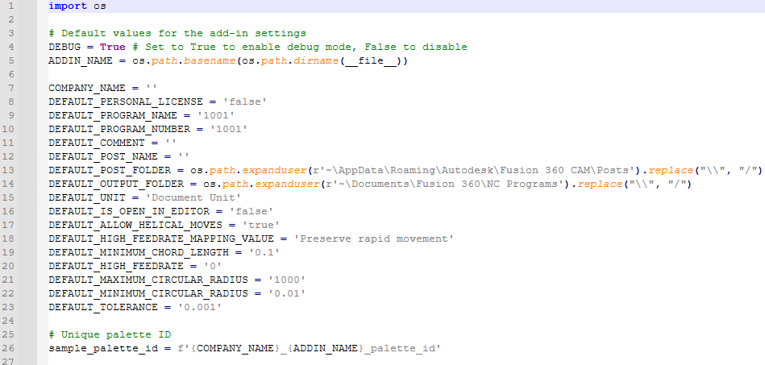

<h1 align="center">
  
  SmartPost for Fusion 360
</h1>

<p align="center">
  <strong>Alternative to standard Fusion 360 post-processing and removal of Personal license restrictions</strong>
</p>

<p align="center">
  <a href="LICENSE.md">
    
  </a>
</p>

---


## Table of Contents

- [Table of Contents](#table-of-contents)
- [Overview](#overview)
- [Key Features](#key-features)
  - [Notes:](#notes)
- [Technical Constraints\*\*](#technical-constraints)
- [Installation \& Usage](#installation--usage)
  - [Configuration](#configuration)
- [Roadmap](#roadmap)
    - [**Q3 2025**](#q3-2025)
    - [**Q1 2026**](#q1-2026)
- [License \& Disclaimer](#license--disclaimer)
  - [Contact Me](#contact-me)

---

## Overview

<details>
  <summary>Click to see the image</summary>
  <h1 align="center">
    
  </h1>
</details>

**SmartPost** bridges the gap between **Fusion 360 Personal** and commercial CAM capabilities by leveraging the undocumented XML post-processing pipeline. This add-in provides:

**SmartPost enhances Fusion 360 capabilities by delivering:**

1. **Full toolchange operations output** (restricted in Personal license)
2. **No Watermarks** (restricted in Personal license) 
3. **Simplified NCPrograms interface alternative** (first-ever implementation for Fusion 360)  
4. **G-code generation using any Fusion 360 postprocessors** (standard .cps files)
5. **Extensibility and open platform** (customizable for various workflows and third-party integrations)

> ⚠️ **Technical foundation**: utilizes **post.exe** engine via **xml.cps** intermediate files.

---

## Key Features

| Feature                |    Commercial     |            Personal            |
|------------------------|-------------------|--------------------------------|
| Automatic Tool Changes | ✅ Full support  | ✅ Unlimited tools             |
| 3 axis milling         | ✅ Full support  | ✅ Any `.cps` compatible       |
| **User comments**      | ✅ Full support  | ⚠️ Only program-level comments |
| **Drilling Cycles**    | ✅ Full support  | ⚠️ Expanding cycles (G0/G1)*   |
| **2 axis turning**     | ✅ Full support  | ❌ Not supported yet           |
| **Manual NC**          | ✅ Full support  | ❌ Not supported yet           |
| **Rapid moves**        | ✅ Full support  | ❌ Not supported yet           |
| **Probing**            | ✅ Full support  | ❌ Not supported yet           |
| **3+2 axis milling**   | ✅ Full support  | ❌ Not supported yet           |

### Notes:
1. **Legend**:
   - ✅: Fully supported
   - ⚠️: Partially supported (with limitations)
   - ❌: Not supported yet

2. **Expanding cycles (G0/G1)**: Uses basic linear moves instead of canned cycles for drilling operations.

3. **Limitations in Fusion 360 XML Post-Processing**:
   Due to restrictions in Fusion 360's XML post-processing framework (**`xml.cps`**), the following features are **not supported** in this release.

---

## Technical Constraints**

**SmartPost Final G-code in 2 Stages:**

1. **Fusion 360**:
   - Uses `xml.cps` for post-processing. The `xml.cps` file contains configuration settings specific to the machine and tool operations.
   - Fusion 360 CAM generates intermediate XML files that contain machining data. These intermediate files are then merged into one final file.

2. **post.exe**:
   - The external post-processor for Fusion 360 takes the generated `.xml` and `.cps` files as input.
   - It processes these files and creates the final machining instructions, which are then used to generate the correct G-code for the CNC machine.


   ```mermaid
   graph LR
     A(Fusion 360 CAM) --> B{xml.cps}
     B --> C(post.exe + any .cps post)
     C --> D((G-code))
   ```

---

## Installation & Usage

<details>
  <summary>Click to see the image</summary>
  <h1 align="center">
    
    
  </h1>
</details>

- ### Setup
1. Download latest `.zip` release. 
2. Extract the archive.
3. Copy the add-on folder to the following directory:  
**`%appdata%\Autodesk\Autodesk Fusion 360\API\AddIns`**.
1. Open **Fusion 360**.
2. Press **`Shift + S`** or go to **Tools → Scripts and Add-Ins**.
3. In the upper part of the window, click on the **plus** (**`+`**).
4. In the Add-Ins dialog, choose `Link an App from Local` to load your add-on directly from a local folder. Navigate to the folder where your add-on is located and select it.
5. Select the add-on from the list and click **`Run`**.
6. To have the add-on run automatically at startup, check the **`Run on Startup`** box.

**⚠️ Important:**
- **SmartPost** works **only on Windows**.
- If the **AddIns** folder doesn't exist, create it manually.
- If the add-on doesn't run, try restarting Fusion 360.

### Configuration

SmartPost default settings are in the `config.py` file:

<details>
  <summary>Click to see the image</summary>
  <h1 align="center">
    
  </h1>
</details>

---

## Roadmap

Planned improvements for future releases:

#### **Q3 2025**
**Postprocessor Enhancements**
  Improve support for the intermediate XML format, including:
  - 2D turning operations
  - Drill cycles
  - Manual NC code insertion

#### **Q1 2026**
  Extend the list of configurable parameters for the postprocessor

**Community contributions welcome!** See [CONTRIBUTING.md](CONTRIBUTING.md) for development guidelines.

**Found a bug?** [Open an Issue](https://github.com/MaestroFusion360/SmartPost/issues)

---

## License & Disclaimer

This project is licensed under the **MIT License** - see the [LICENSE.md](LICENSE.md) file for full details.

Key points:
- ✅ 100% legal (uses official Fusion 360 APIs)
- ❌ Not affiliated with Autodesks
- ⚠️ Not a replacement for commercial licenses

> "SmartPost demonstrates what Fusion 360 Personal *could* be — limitations are imposed by Autodesk, not the technology."

---

### Contact Me

**Let's connect!**

**Email:** [maestrofusion360@gmail.com](mailto:maestrofusion360@gmail.com)
**Telegram:** [@MaestroFusion360](https://t.me/MaestroFusion360) 

---

<p align="center">
  
</p>
